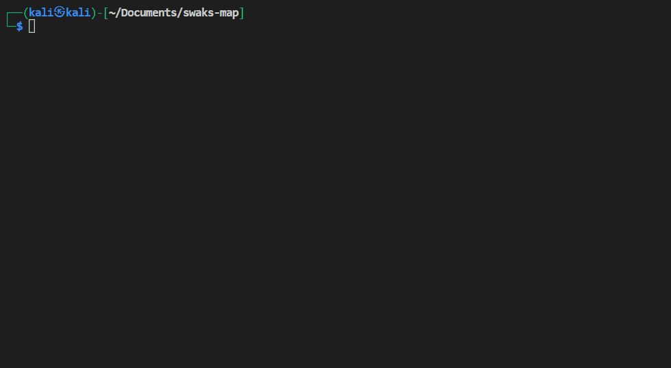
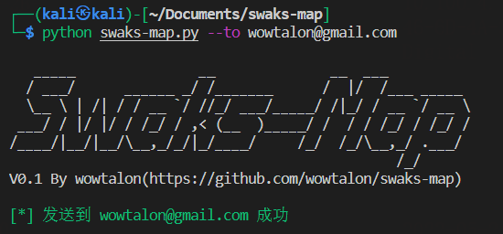

# Swaks-Map

---

<pre>
   _____               __              __  ___          
  / ___/      ______ _/ /_______      /  |/  /___ _____ 
  \__ \ | /| / / __ `/ //_/ ___/_____/ /|_/ / __ `/ __ \
 ___/ / |/ |/ / /_/ / ,< (__  )_____/ /  / / /_/ / /_/ /
/____/|__/|__/\__,_/_/|_/____/     /_/  /_/\__,_/ .___/ 
                                               /_/ 
</pre>

## 介绍

调用 [Swaks](https://github.com/jetmore/swaks) 实现批量发送邮件，此外还基于 [JinJa2](https://jinja.palletsprojects.com/) 实现了 HTML 邮件模板。支持：

+ 批量邮件发送，并且支持自定义发送时间间隔

+ 使用指定账号登录 SMTP 服务器发送邮件

+ 指定 EML 文件发送

+ 使用 HTML 文件作为邮件模板，通过命令行指定参数注入到 HTML 模板中，实现动态邮件内容

## 快速开始

```bash
git clone https://github.com/wowtalon/swaks-map.git

cd swaks-map

pip install -r requirements.txt

python swaks-map.py -h
```



## 发送邮件

```bash
python swaks-map --to wowtalon@gmail.com
```

