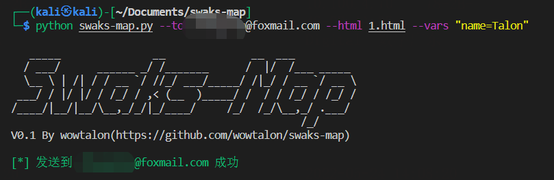
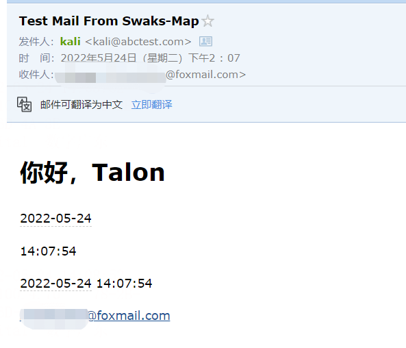

# Swaks-Map

---

<pre>
   _____               __              __  ___          
  / ___/      ______ _/ /_______      /  |/  /___ _____ 
  \__ \ | /| / / __ `/ //_/ ___/_____/ /|_/ / __ `/ __ \
 ___/ / |/ |/ / /_/ / ,< (__  )_____/ /  / / /_/ / /_/ /
/____/|__/|__/\__,_/_/|_/____/     /_/  /_/\__,_/ .___/ 
                                               /_/ 
</pre>

## 介绍

调用 [Swaks](https://github.com/jetmore/swaks) 实现批量发送邮件，此外还基于 [JinJa2](https://jinja.palletsprojects.com/) 实现了 HTML 邮件模板。支持：

+ 批量邮件发送，并且支持自定义发送时间间隔

+ 使用指定账号登录 SMTP 服务器发送邮件

+ 指定 EML 文件发送

+ 使用 HTML 文件作为邮件模板，通过命令行指定参数注入到 HTML 模板中，实现动态邮件内容

## 快速开始

```bash
git clone https://github.com/wowtalon/swaks-map.git

cd swaks-map

pip install -r requirements.txt

python swaks-map.py -h
```


## 发送邮件

### 发送单封邮件

```bash
python swaks-map.py --to wowtalon@gmail.com
```


### 批量发送

```bash
python swaks-map.py --to emails.txt
```

### 登录 SMTP 发送

```bash
python swaks-map.py --to emails.txt --server smtp.163.com --au xxxx@163.com --ap xxx --mail-from xxxx@163.com
```

### HTML 模板发送

```html
<!-- test.html -->
<!DOCTYPE html>
<html lang="en">
<head>
    <meta charset="UTF-8">
    <meta http-equiv="X-UA-Compatible" content="IE=edge">
    <meta name="viewport" content="width=device-width, initial-scale=1.0">
    <title>{{ title }}</title>
</head>
<body>
    <h1>你好，{{ name }}</h1><!-- 通过命令行指定的变量 -->
    <p>{{ date }}</p><!-- 内置变量 -->
    <p>{{ time }}</p><!-- 内置变量 -->
    <p>{{ datetime }}</p><!-- 内置变量 -->
    <p>{{ mail_to }}</p><!-- 内置变量 -->
</body>
</html>
```

```bash
python swaks-map.py --to wowtalon@gmail.com --html test.html --vars "name=Talon"
```



收件截图：


